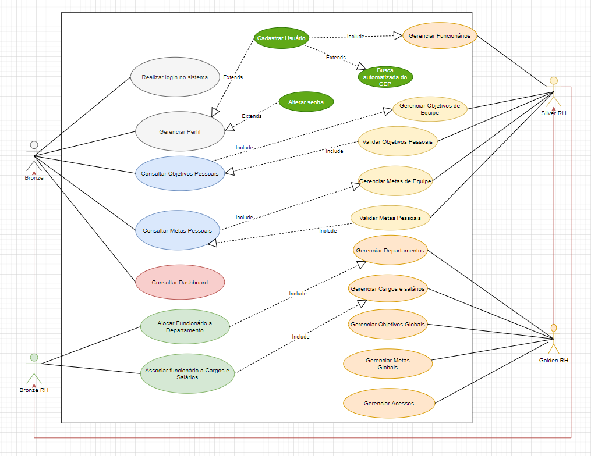

# Especificações do Projeto

Como citado anteriormente, nosso projeto tem foco em desenvolver um sistema que auxilie diversas empresas na análise de crescimento e desenvolvimento de cada colaborador, criando metas e relatórios trimestrais com o intuito de trazer agilidade e simplicidade de informações, e assim, trazendo um crescimento contínuo entre empresas e colaboradores ou vice-versa.

## Personas

| **Lucas De Oliveira Santos** |      |      |
|------------------------------|------|------|
| | **Idade:** 32 anos  | **Ocupação:** foi promovido a Gerente do setor de RH há aproximadamente 2 anos, trabalha na empresa Xing Ling do Brasil, uma multinacional de grande porte.   |
| **Motivações:** Lucas tem ótimas ideias de gerenciamento e controle da produção, bem como, a gestão de expectativas de carreira e motivacional.	| **Frustrações:** Atualmente Lucas tem dificuldades de acompanhar/avaliar as metas e os objetivos profissionais de cada funcionário, pois não possui uma ferramenta sistematizada que fornece dados estatísticos dos funcionários. | **Hobbies, História:** Lucas sonha em revolucionar as relação funcionário x empregador e, para isso, dedica parte de seu tempo em estudo, pesquisas e treinamentos em inovações de RH.|

| **Melissa Fernandes Santos** |      |      |
|------------------------------|------|------|
| | **Idade:** 22 anos  | **Ocupação:** Estagiária do setor de RH na empresa Xing Ling do Brasil. Faz faculdade de Ciências Contábeis e obteve uma oportunidade de expressar seus conhecimentos contábeis junto ao setor de RH.                        |
| **Motivações:** Melissa está conhecendo o mercado de trabalho e viu a oportunidade de trabalhar na empresa de Lucas desafiadora pois conciliar contabilidade com RH será um desafio inovador para sua carreira.	| **Frustrações:** Não domina a maratona de atividades do RH e precisa se orientar dentro da empresa através de uma ferramenta de suporte e capacitação. | **Hobbies, História:** Além de ser uma jogador de vôlei e estudante, Melissa dedica uma fração do tempo em pesquisa e desenvolvimento interpessoal. |                    |

| **Lúcia De Medeiros Silva** |      |      |
|-----------------------------|------|------|
| | **Idade:** 42 anos  | **Ocupação:** Supervisora de RH na empresa Xing Ling do Brasil. Faz o gerenciamento do time e atividades de RH.|
| **Motivações:** Lúcia está na empresa a 10 anos e foi recentemente promovida à supervisora de RH. Está motivada com as ideias e metodologias de Lucas e está empenhada em fazer acontecer a inovação na empresa.	| **Frustrações:** A ausência de ferramentas sistematizadas de gestão de RH, onera seu tempo de pensamento inovador com funções operacionais de preenchimento de formulários de cadastros, envio e recebimento de malotes, dentre outras necessidades do setor. | **Hobbies, História:** Lucia realiza um sonho de estudar e conhecer belas artes. |

| **Lara Fernandes da Silva** |      |      |
|-----------------------------|------|------|
| | **Idade:** 27 anos  | **Ocupação:** Engenheira de Software na empresa Xing Ling do Brasil. Promove as mudanças de TI.|
| **Motivações:** Lara entende que se existe mudança na organização é poorque a organização está crescendo.	| **Frustrações:** Sente-se "limitada" na contribuição do crescimento da organização por não conhecer o perfil dos profissionais que transitam pela empresa. | **Hobbies, História:** Estudante de Tecnolgodia de desenvovilemnto de sistema e, nas horas de folga, nadadora. |

| **João Matheus de Souza** |      |      |
|-----------------------------|------|------|
| | **Idade:** 25 anos  | **Ocupação:** Engenheiro Industrial na empresa Xing Ling do Brasil. Operações de produção.|
| **Motivações:** João é um jovem engenheiro que se preocupa em prommover a integração profissional e desenvolvimento do time.	| **Frustrações:** O acesso às ações motivacionais propostas pela empresa são lentas e muitas vezes não pode ser cumprida pelo time por chegarem vencidas. | **Hobbies, História:** Instrutor do Senai e fisioculturista. |

## Histórias de Usuários

Com base na análise das personas forma identificadas as seguintes histórias de usuários:

|EU COMO... `PERSONA`| QUERO/PRECISO ... `FUNCIONALIDADE` |PARA ... `MOTIVO/VALOR`                 |
|--------------------|------------------------------------|----------------------------------------|
|Lucas | Receber dados estatísticos de funcionários | Analisar tendências, cumprimento das metas e atendimento aos objetivos. |
|Lucas | Estabelecer metas para atingimento em curto, médio e longo prazo | Balanceamento e cadastro pelo time de RH. |
|Lucas | Fornecer objetivos ara atingimento em curto, médio e longo prazo | Balanceamento e cadastro pelo time de RH. |
|Lucia  | Realizar cadastros de funcionários       | Adicionar funcionários ao Banco de Dados da empresa          |
|Lucia  | Realizar cadastros de metas       | Gerar controle de metas          |
|Lucia  | Realizar cadastros de objetivos       | Gerar controle de objetivos         |
|Melissa| Controlar metas      | Que reflitam com clareza os indicadores de performance|
|Melissa| Controlar objetivo   | Que reflitam com clareza os indicadores de aperfeiçoamento profissional|
|Joao Matheus| Acompanhar metas individuais    | Que cada membro da equipe cumpra as metas individuais  |
|Joao Matheus| Acompanhar metas de Equipe    | Que cada equipe cumpra metas as metas de equipe  |
|Joao Matheus| Acompanhar objetivos individuais  | Garantir o aperfeicoamento profissional de cada membro da equipe|

## Requisitos

As tabelas que se seguem apresentam os requisitos funcionais e não funcionais que detalham o escopo do projeto.

### Requisitos Funcionais

|ID    | Descrição do Requisito  | Prioridade |
|------|-------------------------|------|
|RF01| O Sistema deverá Permitir o login de funcionários da empresa | ALTA | 
|RF02| O Sistema deverá Permitir o recuperação de senha | BAIXA | 
|RF03| O Sistema deverá Permitir o gerenciamento de usuários (CRUD) | ALTA | 
|RF04| O Sistema deverá Permitir que o Usuário Silver RH deverá gerenciar funcionários (CRUD) | ALTA | 
|RF05| O Sistema deverá Permitir que o Usuário Golden RH deverá gerenciar Departamentos (CRUD) | ALTA |
|RF06| O Sistema deverá Permitir que o Usuário Silver RH deverá gerenciar metas (CRUD) | ALTA | 
|RF07| O Sistema deverá Permitir que o Usuário Silver RH deverá gerenciar objetivos (CRUD) | BAIXA | 
|RF08| O Sistema deverá Permitir que o Usuário Golden RH deverá gerenciar cargos e salários (CRUD) | BAIXA | 
|RF09| O Sistema deverá Permitir que o Usuário Silver RH deverá cadastrar Metas para Funcionário | ALTA |
|RF10| O Sistema deverá Permitir que o Usuário Silver RH deverá cadastrar Objetivos para Funcionário | BAIXA | 
|RF11| O Sistema deverá Permitir que o Usuário Silver/Golden RH deverá associar um Funcionário a um deparamento | ALTA |
|RF12| O Sistema deverá Permitir que o Usuário Bronze/Silver/Golden deverá consultar relatórios estatísticos | ALTA | 
|RF13| O Sistema deverá Permitir que o Usuário Bronze/Silver/Golden RH deverá associar um funcionário a um cargo e salário | MÉDIA | 
|RF14| O Sistema deve permitir que o Usuário Bronze/Silver/Golden possa consultar relatório de acompanhamento das metas | MÉDIA | 
|RF15| O Sistema deve permitir que o Usuário Bronze/Silver/Golden possa consultar relatório de acompanhamento anual dos objetivos | BAIXA | 
|RF16| O Sistema deve permitir que o Usuário Bronze/Silver/Golden RH possa cadastrar metas atingidas/não atingidas| ALTA | 
|RF17| O sistema deverá emitir ranqueamento (top 5) de: metas atingidas, metas não atingidas. | ALTA |
|RF18| O Sistema deve conter uma busca de CEP automatizada | ALTA |

### Requisitos não Funcionais

|ID     | Descrição do Requisito  |Prioridade |
|-------|----------------------------|------|
|RNF-001| O sistema de ser feito usando práticas de UX e IxD   | ALTA | 
|RNF-002| O sistema deve ser disponibilizado publicamente no GitHub. | ALTA | 
|RNF-003| O sistema deve apresentar baixo tempo de resposta nas requisições. | ALTA | 
|RNF-004| O sistema deve apresentar um filtro para pesquisas. | ALTA | 
|RNF-005| O sistema deve ser implementado em C#. | ALTA | 
|RNF-006| O sistema deve ser responsivo e compatível com os principais navegadores. | ALTA | 

## Restrições

O projeto está restrito pelos itens apresentados na tabela a seguir.

|ID| Restrição                                             |
|--|-------------------------------------------------------|
|01| O projeto deverá ser entregue até o final do semestre |
|02| Não pode ser desenvolvido um módulo de backend        |
|03| A Proposta contempla a construção de no máximo 03 relatórios|
|04| Cada relatório deverá conter no máximo 1 gráfico|

## Diagrama de Casos de Uso

|ATOR|	DESCRIÇÃO|
|----|-----------|
|Bonze| Ator que desempenha o papel de funcionário padrão da empresa, realiza consulta seu desempenho e metas, efetiva seu cadastro, login e alteração de senha, além de consultar o dashboard da organização. |
|Bonze RH| Ator que desempenha o papel de funcionário padrão da empresa no setor de RH, realiza as funções do ator Bronze e é capaz de realizar algumas funções específicas de RH. |
|Silver| Ator que desempenha o papel de funcionário administrativo, podendo realizar atividades específicas conforme necessidades da organização|
|Silver RH| Ator que desempenha o papel de funcionário realiza o gerenciamento de funcionários, objetivos pessoais e de equipe, validação do cumprimento de metas além das funcões designadas ao Bronze RH|
|Golden RH| Responsável pelo gerenciamento de departamentos, cargos e salários, definção de objetivos, gerenciamento de metas globais e gerenciamento de acessos. Possui, também, as atribuições de um Silver RH.|

|CASO DE USO|	DESCRIÇÃO|	RF|
|-|-|-|
|Realizar login no sistema|	O funcionário deve conseguir realizar login com suas credenciais no sistema.| RF01 / RF02|
|Gerenciar Perfil|	O funcionário deve conseguir gerenciar perfil: (atualizar dados do pessoas e alterar senha) no seu perfil.|	RF03 |
|Consultar Objetivos Pessoais| O funcionário deve consultar seus objetivos pessoais| RF07|
|Consultar Metas Pessoais| O funcionário deve consultar suas metas pessoais| RF06 |
|Consultar Dashboard | O sistema dever permitir ao funcionários consultar dos dados do dashboard| RF14, RF15, RF16, RF17 | 
|Alocar Funcionário ao departamento | O sistema deve permitir ao funcionário o gerenciamento de departamentos | RF05 / RF11 | 
|Associar Funcionário a Cargos e Salários| O sistema deve permitir ao funcionário o gerenciamento de cargos e salários. | RF08 / RF13| 
|Gerenciar Funcionários|O sistema deve permitir ao funcionário o gerenciamento de funcionários  | RF04|
|Gerenciar Objetivos de Equipe|O sistema deve permitir ao funcionário o gerenciamento dos objetivos de equipe  | RF07|
|Gerenciar Metas de Equipe|O sistema deve permitir ao funcionário o gerenciamento das metas de equipe | RF06|
|Validar Ojetivos Pessoais|O sistema deve permitir ao funcionário a validação dos objetivos pessoais  | RF07|
|Validar Metas Pessoais|O sistema deve permitir ao funcionário a validação das metas pessoais  | RF06|
|Gerenciar Departamentos|O sistema deve permitir ao funcionário o gerenciamento dos departamentos da empresa  | RF05 / RF11|
|Gerenciar Cargos e Salários|O sistema deve permitir ao funcionário o gerenciamento de cargos e salários da empresa | RF08 / RF13|
|Gerenciar Objetivos globais|O sistema deve permitir ao funcionário o gerenciamento dos objetivos globais  | RF07/ RF08 / RF15|
|Gerenciar Metas globais|O sistema deve permitir ao funcionário o gerenciamento das metas de equipe | RF06 / RF09 / RF14 / RF16 / RF17|
|Gerenciar Acessos|O sistema deve permitir ao funcionário o gerenciamento dos acesso conforme Golde, Silver e Bronze | RF04|

 ## Representação Visual
 Diagrama de Caso de Uso
 

