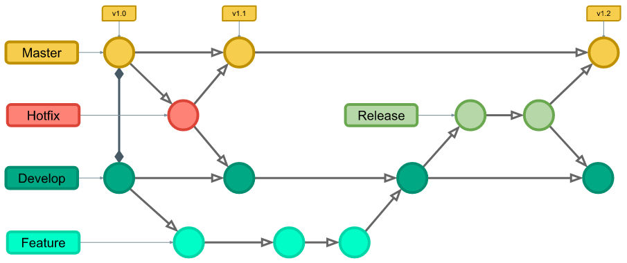

# Metodologia

Pré-requisitos: Documentação de Especificação

A metodologia contempla as definições de ferramental utilizado pela equipe tanto para a manutenção dos códigos e demais artefatos quanto para a organização do time na execução das tarefas do projeto.

Descreva aqui a metodologia de trabalho do grupo para atacar o problema. Definições sobre os ambiente de trabalho utilizados pela equipe para desenvolver o projeto. Abrange a relação de ambientes utilizados, a estrutura para gestão do código fonte, além da definição do processo e ferramenta através dos quais a equipe se organiza (Gestão de Times).

## Relação de Ambientes de Trabalho

Os artefatos do projeto são desenvolvidos a partir de diversas plataformas e a relação dos ambientes com seu respectivo propósito é apresentada na tabela que se segue:

Ambiente|Plataforma|Link de Acesso
|:--------|:----------:|:--------------:|
|Repositório|GitHub|  [GitHub](https://github.com/ICEI-PUC-Minas-PMV-ADS/grow-human-resources)|
|Documentos do projeto|GitHubDocs|Projeto Grow Human Resources|[GitHub]()|
|Projeto de Interface e  Wireframes|Figma|Figma |[Figma]() | Ferramenta de colaboração e design de UI/UX rápida e avançada)|
|Gerenciamento do Projeto|Github|Gow Human Resources (github.com)|

## Controle de Versão

A ferramenta de controle de versão adotada no projeto foi o
[Git](https://git-scm.com/), sendo que o [Github](https://github.com)
foi utilizado para hospedagem do repositório.

Para gestão do código fonte do software desenvolvido, o grupo utiliza um processo baseado no Git Flow, como mostra a Figura. Desta forma, todas as manutenções no código são realizadas em branches separados, identificados como Hotfix, Release, Develop e Feature.   

O projeto segue a seguinte convenção para o nome de branches:

- `main`: versão estável já testada do software
- `unstable`: versão já testada do software, porém instável
- `testing`: versão em testes do software
- `dev`: versão de desenvolvimento do software

Quanto à gerência de issues, o projeto adota a seguinte convenção para
etiquetas:

- `documentation`: melhorias ou acréscimos à documentação
- `bug`: uma funcionalidade encontra-se com problemas
- `enhancement`: uma funcionalidade precisa ser melhorada
- `feature`: uma nova funcionalidade precisa ser introduzida

## Gerenciamento de Projeto

### Divisão de Papéis: 

Desenvolvedora - Vitória Gabriella Maffei Corrêa 
branch: dev/Vitoria

### Processo

No processo está sendo ultilizado o método Kamban e também Criado um Backlog no Github.
 
### Ferramentas

As ferramentas empregadas no projeto são:

- Editor de código - Visual Code, Visual Studio.
- Ferramentas de comunicação - WhatsApp, Microsoft Teams.
- Ferramentas de desenho de tela - Dra.wio, Figma.

O editor de código foi escolhido porque ele possui uma integração com o
sistema de versão. As ferramentas de comunicação utilizadas possuem
integração semelhante e por isso foram selecionadas. Por fim, para criar
diagramas utilizamos essa ferramenta por melhor captar as
necessidades da nossa solução.

