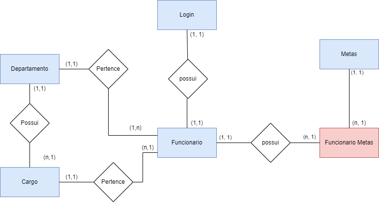

# Arquitetura da Solução

Pré-requisitos: <a href="3-Projeto de Interface.md"> Projeto de Interface</a>

Definição de como o software é estruturado em termos dos componentes que fazem parte da solução e do ambiente de hospedagem da aplicação.

## Diagrama de Classes

## Modelo ER

## Esquema Relacional

## Tecnologias Utilizadas

Para a implantação da solução para criar os diagramas utilizamos o [diagrama](https://draw.io/), já para os protótipos o [Figma](https://www.figma.com/) e para o desevolvimento back-end e front-end: [Visual Studio](https://visualstudio.microsoft.com/pt-br/) para C# com banco de dados[SQL Sever](https://www.microsoft.com/pt-br/sql-server/sql-server-downloads), [Visual Code](https://code.visualstudio.com/download) para desenvolver HMTL, CSS e Js. Frameworks: [Bootstrap](https://getbootstrap.com/).

