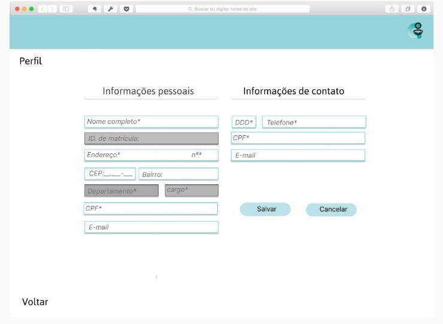

# Template Padrão da Aplicação

Pré-requisitos: <a href="2-Especificação do Projeto.md"> Especificação do Projeto</a>, <a href="3-Projeto de Interface.md"> Projeto de Interface</a>, <a href="4-Metodologia.md"> Metodologia</a>

Layout padrão da aplicação que será utilizado em todas as páginas com a definição de identidade visual, aspectos de responsividade e iconografia.

## Guia de Estilos

Antes de definir o template da aplicação, foi necessário definir uma guia de estilos com todos os padrões que serão utilizados durante o desenvolvimento do projeto. Estão detalhados nos itens a seguir:

### Paleta de Cores

A paleta de cores definida para nosso sistema conta com 4 cores que reflete calma e serenidade para o usuário.

## Tipografia

As fontes selecionadas para a aplicação são Jaldi e Inter em algumas das suas variações e seguem as seguintes definições:

## Icones

## Aplicação nas telas e fluxos:

## Wireframes

## Tela - LandingPage / Login 

A tela de login ou Landing Page, permite o funcionário e seu supervisor a fazer o login para acesso as demais atividades, como se trata de um sistema empresarial optamos por dar informações somente a aqueles que são associados a empresa em questão.  Nesta tela também temos as opções caso os demais usuários esqueçam suas senha e precise recupera-la.

Figura 1

## Tela - Recuperação de senha 

Ao acessar a "Esqueceu sua senha?" será encaminhado para uma tela de recuperação como mencionado na Figura 1. O usuário precisaram inserir seu e-mail para verificação de identidade.

Figura 2

Após fazer o processo descrito na Figura 2 será encaminhado um código ao e-mail verificado para ser inserido um código de segurança 

Figura 3

Fazendo todo processo anterior, o usuário finalmente conseguira alterar sua senha. Depois de escolher a senha, seguindo o critério de ter 6 dígitos, basta salvar e senha já foi alterada.

Figura 4

## Tela - Homepage 

Depois de fazer o login na aplicação, o usuário é redirecionado para uma homepage que possui um menu Lateral com opções personalizadas para Supervisor e funcionário do lado esquerdo e informações no centro/Lado direito.

Figura 5

## Tela – Meu Perfil

Selecionando a opção "Meu Perfil" o usuário é redirecionado para uma página, na qual tem as "informações Pessoais e as informações de contato" e também sua foto de perfil,  que pode ser alterada clicando em "Trocar de foto".  As informações são editáveis, para editar basta clicar em "Editar" no canto superior direito.

Figura 6

 É possível Alterar quase todos os campos, apenas Matricula, cargo e departamento somente      o supervisor tem acesso para alterar essas informações.

Figura 7

## Tela - Gerenciar Funcionários

Nesta tela somente supervisor terá acesso, ele poderá pesquisar o funcionário por nome editar, adicionar ou excluir.

​     Figura 8

Para começar a manipular dados do funcionário, basta clicar em editar será aberto lacunas de dados editáveis do funcionário, do lado inferior direito e exibido link para exclusão de tal.

Figura 9

Caso novos funcionários sejam admitidos na empresa é possível também adicionar no sistema clicando no botão de cor azul "Adicionar funcionários" após preencher a lacunas é só selecionar "Adicionar" e pronto, o funcionário foi adicionado no sistema.

Figura 10

## Tela - Ranking

Um ranking editável também se encontra no sistema, está página somente o supervisor tem acesso ele poderá visualizar o ranking é também editado.

Figura 11

Para editar basta clicar em "Editar" as linhas editáveis ficaram em cor azul

Figura 12

## Tela - Relatórios

Para adicionar relatórios o sistema tem uma página aonde é possível ser adicionado. Funcionários e supervisores tem acesso a está página, mas somente os supervisores podem pesquisar relatórios por departamento, funcionários só podem ver os relatórios dos seus respectivos departamentos.

Figura 13

## Tela - Metas

O sistema tem uma tela de metas, aonde todos os funcionários tem acesso independente do cargo, nela mostra as principais metas e o resultado do funcionário, tendo metas de resultado, desempenho e de processo. Indicando o resultado por meio de barras de indicadoras quanto mais cheia a barra estiver, significa que o funcionário esta ótimo (atribuída a cor verde),  caso esteja meio cheia significa que o funcionário está mediano (atribuído a cor amarela), e se a barra estiver vazia o funcionários está ruim (atribuído a cor vermelha).

Figura 14
