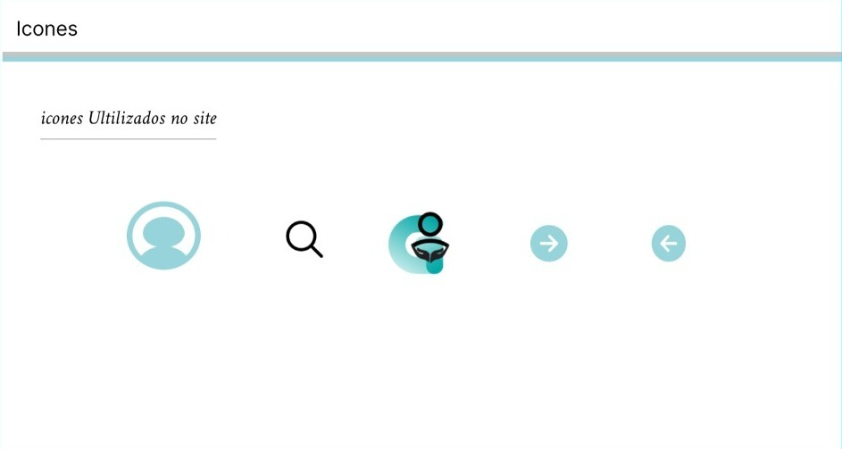

# Template Padrão da Aplicação

Pré-requisitos: <a href="2-Especificação do Projeto.md"> Especificação do Projeto</a>, <a href="3-Projeto de Interface.md"> Projeto de Interface</a>, <a href="4-Metodologia.md"> Metodologia</a>

Layout padrão da aplicação que será utilizado em todas as páginas com a definição de identidade visual, aspectos de responsividade e iconografia.

## Guia de Estilos

Antes de definir o template da aplicação, foi necessário definir uma guia de estilos com todos os padrões que serão utilizados durante o desenvolvimento do projeto. Estão detalhados nos itens a seguir:

### Paleta de Cores

A paleta de cores definida para nosso sistema conta com 4 cores que reflete calma e serenidade para o usuário.

## Tipografia

As fontes selecionadas para a aplicação são Jaldi e Inter em algumas das suas variações e seguem as seguintes definições:

## Icones

